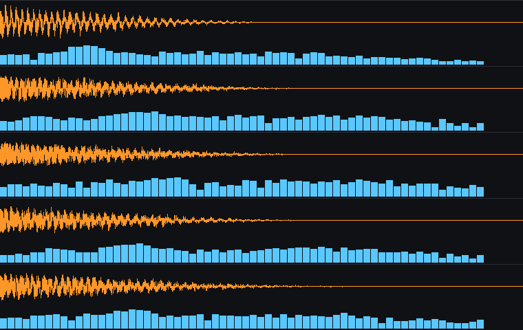
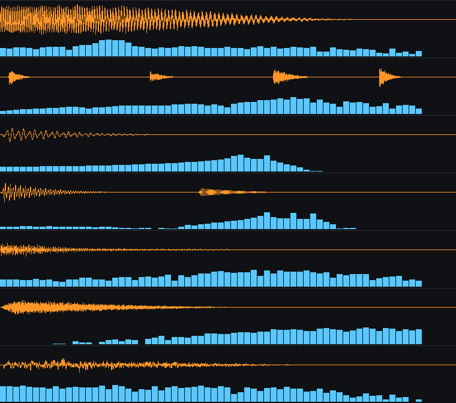

# The audio pipeline

The game ships no sound files. Every gunshot, footstep, impact, announcement, ambience bed
and music track is synthesised on the device at load time, for the same reasons the
textures are — and for one reason the textures do not have.

A weapon's report is derived from the same `WeaponData` the damage model reads. A round
that does more damage at a lower rate of fire is a bigger round, so it gets a lower body,
a longer tail and more low-mid punch. Rebalancing a weapon rebalances how it sounds, and
there is no way for the two to drift apart, because there is only one number.

## Layers

```
Synth (core, Foundation only, unit-tested)
   oscillators · noise · sweeps · envelopes · state-variable filter · saturation · room
        │
        ▼
Waveform — mono float samples, with mixing, normalising, fading, looping, resampling
        │
        ▼
SoundBank — one recipe per sound, resolved by the name the game already asks for
        │
        ▼
ProceduralSoundLibrary (app) — AVAudioPCMBuffer at the device's sample rate, cached
        │
        ▼
AudioEngine — spatialised through AVAudioEnvironmentNode, pooled voices
```

`AudioEngine` has always looked sounds up by string: `sfx_ar_vanguard_fire`,
`sfx_step_metal`, `amb_desert_wind`. Nothing about that changed. A bundled file of the
same name still wins, so real recordings can be dropped in later without touching a line
of the synthesis.

## What a gunshot is

Four layers, and leaving any one out is immediately audible:

| Layer | What it is | Where it comes from |
| --- | --- | --- |
| Crack | the supersonic snap, gone in ten milliseconds | high-passed noise, 0.4 ms attack |
| Body | the blast itself, dulling as it decays | noise through a falling low-pass |
| Thump | the punch you feel more than hear | a sine sweeping down |
| Action | the bolt, quieter and a fraction later | band-passed noise at +12 ms |

Then saturation, and a room built from comb filters at incommensurate spacings.

## Two mistakes worth recording

**The low end was inaudible and still took all the headroom.** The first version swept the
thump down to 42 Hz. It measured beautifully — a full-scale peak — and a phone speaker
reproduces almost nothing below about 200 Hz, so all that energy did was force the
normaliser to scale down the crack and the body, the parts you can actually hear. Every
percussive sound now stays in the low mids and the final mix is high-passed at 62 Hz. The
same mistake had put the music bed's fundamental at 55 Hz; it is an octave up.

**The room made the gunshot swell.** Run as four in-place delay passes, the reflections
compounded until the loudest moment of a sniper shot was fifty milliseconds after the
trigger — a swell, not a shot. Each comb filter now takes the dry signal, feeds back only
into itself, and is mixed *under* the dry rather than added into it.
`testRoomKeepsTheDirectSoundLoudest` pins it: the peak of a filtered impulse must still be
at sample zero.

The tail was also eleven seconds long to produce about one second of audible ring, at
44.1 kHz, per weapon. `trimmedSilence` cuts it once it falls below audibility, with a short
release so the cut itself makes no sound.

**The filter was blowing up, and `sanitized()` was hiding it.** The obvious
state-variable filter — the Chamberlin form — is only *conditionally* stable: it needs
`2·sin(π·fc/fs) < 2 − 1/Q`. This file asks for 4.2 kHz on the music tick, 5.2 kHz on the
smoke hiss and 3.8 kHz on impact grit, and every one of those is past the limit at ordinary
resonance. At 8 kHz the state diverges to infinity within a few hundred samples. Real game
sounds were being produced by a diverging filter, and `sanitized()` then quietly replaced
the infinities with zeros, so nothing crashed and nothing looked obviously wrong.

`testFilterIsStableAtExtremeSettings` is what caught it, which is exactly why it was
written. The filter is now a topology-preserving transform, which has no stability
condition at all: verified stable across every cutoff and resonance the tests exercise,
with a correct −3 dB point at the cutoff and 60 dB of rejection on a 60 Hz sine through a
2 kHz high pass.

## Reviewing the audio without a Mac — or ears

`Tools/preview_audio.py` mirrors the Swift in pure Python and renders each sound as a
waveform and a spectrum.

```sh
python3 Tools/preview_audio.py          # writes Docs/previews/audio_*.png
python3 Tools/preview_audio.py --wav    # also writes playable .wav files
```

Nobody working on this can hear the output, but a waveform picture catches everything that
actually goes wrong in synthesis — a filter blowing up, a sound that is silent, one that
clips flat, a transient that is not a transient, a tail three times longer than intended —
and the printed table catches a rifle that is brighter than an SMG when it should be
darker. Both mistakes above were found this way, before a single test ran.



Top to bottom: sniper, rifle, SMG, pistol, shotgun. Orange is the waveform, blue the
spectrum in dB. The report gets shorter and brighter as the round gets smaller, which is
the only thing the pictures need to show.



Explosion, reload, hit marker, headshot, and three footstep surfaces. The reload's four
separated transients — release, magazine out, magazine in, bolt — are what make it read as
a sequence of mechanical events rather than one noise.

## What the tests check

`AudioTests` is the ear. Every sound the game can ask for must exist, be finite, not clip,
not be silent, and not run longer than any sound needs to. Beyond that:

- a gunshot's energy peaks in the first few 10 ms windows and decays from there — as an
  envelope, not a sample peak: the body is a noise burst under a half-second decay, so
  which individual sample is loudest is close to random, and the first version of that
  test failed on a lucky spike 48 ms in;
- a bigger round measures darker than a smaller one;
- a headshot marker measures brighter and longer than a body hit;
- killstreak announcements rise in pitch with the streak;
- grass reads brighter than dirt, metal higher than wood, glass higher than concrete;
- looping beds do not step at the loop point, or every repeat clicks;
- the filter stays stable at every cutoff and resonance a recipe could produce, because a
  self-oscillating state-variable filter is full-scale static straight into headphones.

## Cost

Synthesis is deterministic, so it happens once. The menu set is built at launch off the
main thread — a music bed is tens of milliseconds and that is the first frame the app ever
draws — and the match set is built during the loading screen alongside the textures.
Nothing is ever synthesised on the audio thread mid-match.

There is no disk cache. A gunshot is a few tens of kilobytes and regenerating it costs
about a millisecond, which is cheaper than reading a file.
