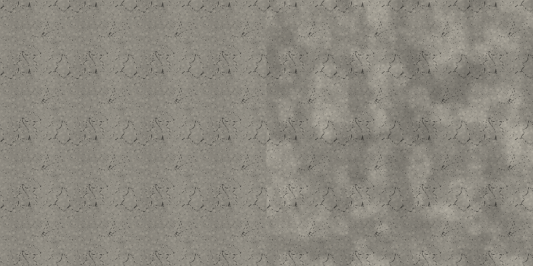
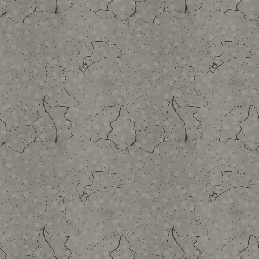
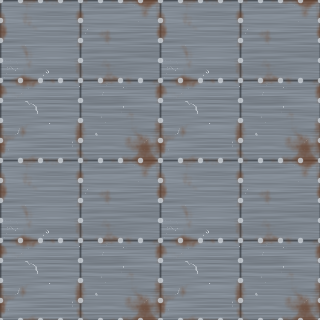
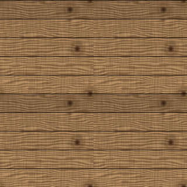
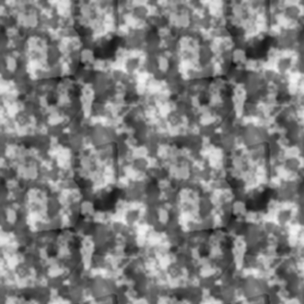

# The art pipeline

The game ships no painted textures, no meshes and no baked lighting. Everything you see is
generated on the device at load time from tileable noise, and the only image files in the
repository are the App Store icon and a menu wordmark — which cannot be generated at
runtime because they have to exist before the app launches.

This is not a shortcut. It buys four things that matter for a mobile shooter:

1. **A tiny download.** A conventional shooter's texture set is hundreds of megabytes. This
   one is a few hundred kilobytes of Swift.
2. **Resolution that follows the device.** The same generator produces 256² on an old phone
   and 768² on a current one, instead of shipping one compromise size.
3. **Maps and materials that cannot drift apart.** The minimap, the map preview and the
   collision geometry all read the same brush data, so moving a wall moves all of them.
4. **A new material is a function, not an art order.** A new weapon finish is a palette and
   a pattern name.

## Layers

```
Noise.swift (core, Foundation only, unit-tested)
   value · gradient · fBm · ridged · cellular · domain warp · seamless wave
        │
        ▼
ScalarField (core, Foundation only, unit-tested)
   a float height field, built by evaluating noise over [0,1)²
        │
        ├─► albedo      shaded from the height field and its masks
        ├─► normal      Sobel of the same height field
        ├─► roughness   from the masks: cracks rough, polish smooth
        ├─► occlusion   height minus its local average
        └─► metalness   where the material is actually metal
        │
        ▼
TextureLibrary — parallel generation during loading, PNG disk cache between launches
        │
        ▼
MaterialLibrary — SCNMaterial with all six maps, anisotropic sampling, mipmaps
```

Deriving every map from one shared height field is the point. A normal map generated
independently of the albedo produces lighting that disagrees with the visible detail, which
is exactly what makes procedural materials look synthetic.

## Seamlessness

Every noise function takes a `period` and wraps its lattice coordinates modulo that period,
so sampling the unit square always tiles. This is the easiest thing in the whole pipeline to
get subtly wrong, and the failure mode — a faint grid across every wall in the level — is
hard to see on a laptop and glaring on a phone.

`NoiseTests` asserts that value, gradient, fBm, ridged, cellular and warped noise all match
across the tile boundary. Wrapping has to survive the *filtering* too, so `ScalarField` lives
in the core alongside the noise and `ScalarFieldTests` pins down the property that matters:
filtering the field and then rolling it gives the same answer as rolling it and then
filtering. A blur that clamped or mirrored at the edges would pass every per-pixel test and
still draw a seam line down every tiled surface in the game; this one cannot.

The one that bit us was sine waves: `sin(x * 0.6)` over a four-cell tile completes 2.4
cycles, so the edges do not meet. `Noise.wave` takes **integer**
cycle counts instead, which makes the mistake impossible to express, and the ripples on
Sandstorm's sand stopped showing a seam.

## Surfaces

Each of the twelve surface types is a small composition of masks. Concrete, for example:

| Mask | Built from | Drives |
| --- | --- | --- |
| Aggregate | cellular, size varied by cell value | albedo tint, height |
| Pits | sparse cellular | height, occlusion |
| Cracks | **cell borders**, warped, two scales | albedo, height, roughness |
| Mottle | low-frequency gradient fBm | broad tonal variation |
| Stains | gradient fBm | darkening |

Cracks are the instructive one. A thresholded ridged-noise field gives disconnected
squiggles; the *boundary* between Worley cells gives a connected polygonal network, which is
how concrete actually fractures. Gating those borders by the cell value keeps the network
broken rather than a full mesh — a fully cracked surface reads as dried mud, not a wall.

## Breaking up the tiling

A surface texture repeats every 2.5 metres. That is deliberate — it is what keeps texel
density constant whether you are looking at a crate or a forty-metre wall — but it means
that wall shows the same tile sixteen times, and the eye finds that grid immediately
however good the tile is. It is the last thing that gives away a procedural material.

So every world material carries a `.surface` shader modifier that multiplies its albedo by
a large, soft variation map sampled in **world** space, at roughly one repeat per 55 metres
— wider than any map in the game, so the variation map itself never visibly tiles. Because
it is world space and not UV space, the pattern is continuous across brush boundaries: two
walls meeting at a corner agree. Roughness is nudged the same way, which is what makes
light travel across a wall instead of sitting flat on it. The whole thing costs one extra
texture fetch, and one image shared by every material in the level.

The map itself is three scales, and it needs all three. Broad fBm on its own reads as fog
drifting across the wall rather than as anything that happened to the wall; the mid band
supplies streaks and stains, and cellular patches supply the flat-toned regions that make
one stretch of concrete look like a different pour.

How much drift each surface tolerates is per-surface: dirt, grass and sand take the most,
because real ground is never one tone, while plastic and fabric take almost none — uneven
paint on a moulded crate reads as a rendering bug, not as weathering.

The same tile, repeated 4×4, without and with it:



## Sky

Six cube faces, evaluated per direction, so they line up at the seams by construction.
Each face composes a horizon gradient, a sun disc with a two-term glow, stars on a
quantized direction hash, and clouds projected onto a flat deck above the viewer.

The cloud coverage control maps onto a **threshold band**, not onto `1 - coverage`: fBm
clusters tightly around 0.5, so the naive mapping only produces clouds at the extremes. The
generated cube map also drives image-based lighting, so every metallic surface in the level
picks up the sky's colour for free.

## Reviewing the art without a Mac

`Tools/preview_textures.py` mirrors the Swift generators in pure Python and renders preview
sheets — each one drawn 2×2 tiled, because that is the only reliable way to spot a seam.

```sh
python3 Tools/preview_textures.py          # writes Docs/previews/
python3 Tools/generate_assets.py           # regenerates the app icon and wordmark
```

It is a design tool, not a test: the Swift code is the shipping implementation, and the
mirror exists so the parameters can be judged by eye. Both were tuned together — the
concrete crack network, the rivets on the metal panel seams, the blood splatter and the
cloud scale all came out of looking at these sheets and changing numbers.





The macro variation map gets the same treatment — tiled 2×2 to prove it is seamless, and
rendered side by side against an unmodulated wall to judge whether the strength is doing
anything at all without turning into blotches:



## Cost

| | First launch | Later launches |
| --- | --- | --- |
| Surfaces used by the map | generated in parallel | read from the PNG cache |
| Weapon skins in the loadout | generated in parallel | read from the PNG cache |
| Sprites and decals | generated in parallel | read from the PNG cache |
| Sky cube map | one pass, six faces | read from the PNG cache |
| Macro variation map | one 256² image for the level | read from the PNG cache |

Generation happens during the loading screen, which is the one moment a game is allowed to
spend CPU, and nothing touches a material afterwards — no texture is ever generated on the
render thread mid-match. The disk cache is keyed by a generation version, so changing a
generator invalidates it. Low-end devices skip the disk cache entirely: at 256² the PNG
round trip costs more than regenerating.
